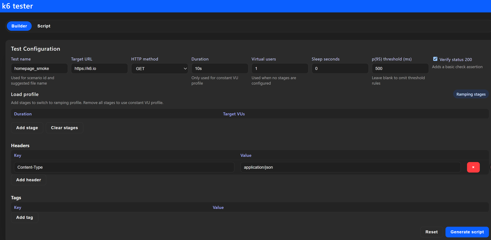
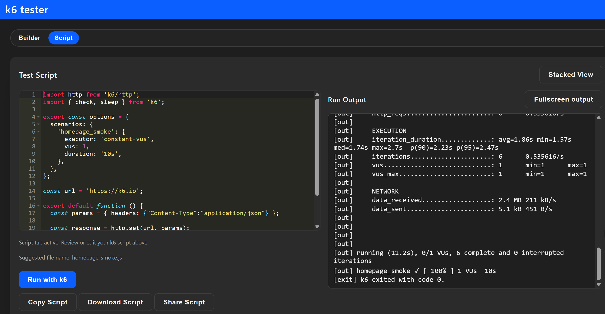

# k6-tester

`k6-tester` is a minimal ASP.NET Core app paired with a lightweight single-page UI that helps you design, run, and share [k6](https://k6.io) load tests without leaving the browser. Use the visual builder to configure scenarios, review the generated JavaScript, and execute it directly through the bundled k6 CLI integration while live output streams back to the page.




## Table of contents

- [Highlights](#highlights)
- [Project layout](#project-layout)
- [Prerequisites](#prerequisites)
- [Quick start](#quick-start)
- [Testing](#testing)
- [Docker](#docker)
- [Local development notes](#local-development-notes)
- [Roadmap](#roadmap)
- [Contributing](#contributing)

## Highlights

- **Visual script builder** – configure constant or ramping VU profiles, HTTP options, headers, payloads, thresholds, and tags with instant script previews.
- **Ready-to-run output** – copy or download the generated script and view the matching `k6 run` CLI command.
- **One-click execution** – trigger the local k6 binary from the UI and stream stdout/stderr back to the browser for quick validation runs.
- **Minimal API endpoints** – `/api/k6/script` returns the generated script as JSON while `/api/k6/run` streams live execution output.
- **Single binary deployments** – ship as a self-contained container image preloaded with k6 or run as a standalone ASP.NET Core app.

## Project layout

```text
.
├── README.md                # Project overview (this file)
├── k6-tester.slnx           # Solution manifest referencing src/ and test/ projects
├── src/
│   └── k6-tester/           # ASP.NET Core minimal API + static SPA
│       ├── Models/          # DTOs that capture script configuration and responses
│       ├── Services/        # Script builder and k6 runner helpers
│       ├── wwwroot/         # Hand-authored HTML/JS UI served via MapFallbackToFile
│       └── Program.cs       # Minimal API setup and endpoint wiring
└── test/
    └── k6-tester.Tests/     # xUnit v3 tests covering script generation logic
```

## Prerequisites

- [.NET 10 SDK](https://dotnet.microsoft.com/download/dotnet/10.0)
- [k6 CLI](https://k6.io/docs/get-started/installation/) available on the machine where you run the app (required for the **Run with k6** action). The rest of the UI works without it.

## Quick start

1. Restore dependencies once per session:

   ```bash
   dotnet restore k6-tester.slnx
   ```

2. Build in Release (mirrors CI expectations):

   ```bash
   dotnet build k6-tester.slnx --configuration Release --no-restore
   ```

3. Run the web app:

   ```bash
   dotnet run --project src/k6-tester/k6-tester.csproj
   ```

4. Open the printed URL (defaults to `http://localhost:5266`) and configure a scenario. **Generate script** to inspect the JavaScript, then **Run with k6** to execute it locally.

The builder emits deterministic script content, making it easy to check into version control or reuse outside the UI.

## Testing

```bash
dotnet test test/k6-tester.Tests/k6-tester.Tests.csproj --configuration Release --no-build
```

Optional coverage:

```bash
dotnet test test/k6-tester.Tests/k6-tester.Tests.csproj --configuration Release --no-build /p:CollectCoverage=true /p:CoverletOutputFormat=opencover
```

## Docker

The provided `Dockerfile` creates a multi-arch image that compiles the app and installs the k6 CLI so UI-triggered runs work in-container.

```bash
# Build a local image
docker build -t k6-tester .

# Run it (ports map to 8080 inside the container)
docker run --rm -p 8080:8080 k6-tester
```

To use a different k6 version, pass the `K6_VERSION` build argument and update any matching CI references:

```bash
docker build -t k6-tester --build-arg K6_VERSION=v0.49.0 .
```

A published image is also available:

```bash
docker run --rm -p 8080:8080 weihanli/k6-tester
```

## Local development notes

- The SPA under `wwwroot/` is hand-authored; avoid automated reformatting to keep diffs review-friendly.
- Service classes follow guard-clause patterns (`ArgumentNullException.ThrowIfNull`) and stream responses. Preserve cancellation and cleanup semantics when changing `K6Runner`.
- Namespace declarations use the file-scoped style introduced in C# 10; continue that convention for new files.
- When adding script options, update both `K6ScriptBuilder` and its tests to keep generated output deterministic.

## Roadmap

1. **Scenario library & persistence** – save generated configurations to a backing store so common tests can be versioned and shared.
2. **Auth-enabled deployments** – integrate ASP.NET Core authentication/authorization so multi-user environments can restrict who runs load tests.
3. **Advanced runners** – plug in remote execution targets (k6 Cloud, distributed agents, containerized workers) with dashboards for run status.
4. **Observability hooks** – stream metrics to Prometheus/InfluxDB/Grafana for richer dashboards and shareable insights.
5. **Extensible script templates** – allow custom JS snippets, checks, and thresholds so teams can extend the generator with reusable building blocks.

## Contributing

Issues and pull requests are welcome. Please follow the workflow above (restore, Release build, Release tests) before submitting changes and include targeted assertions for any new script-generation behavior.
